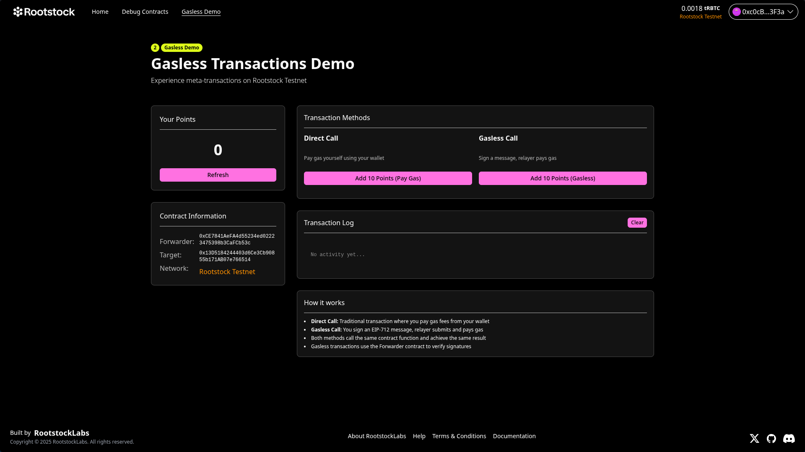

# 🏗 Rootstock Meta-Transaction Relayer

<div align="center">

</div>

<h4 align="center">
  <a href="https://dev.rootstock.io">Rootstock Documentation</a>
  | <a href="QUICKSTART.md">Quick Start Guide</a>
</h4>

A complete gasless meta-transaction implementation for Rootstock, enabling users to interact with smart contracts without paying gas fees.

⚙️ Built using NextJS, RainbowKit, Hardhat, Wagmi, Viem, and Typescript.

## Features

-   ✅ **Gasless Transactions**: Users can execute smart contract calls without holding tRBTC for gas
-   🔄 **Meta-Transaction Relayer**: Backend service that sponsors and relays transactions on behalf of users
-   🎯 **EIP-2771 Forwarder**: Secure meta-transaction forwarding using industry-standard patterns
-   🧱 **Example Implementation**: Complete demo with ExampleTarget contract showing gasless interactions
-   🔐 **Wallet Integration**: Connect with various wallet providers on Rootstock network



## Requirements

Before you begin, you need to install the following tools:

-   [Node (>= v18.18)](https://nodejs.org/en/download/)
-   Yarn ([v1](https://classic.yarnpkg.com/en/docs/install/) or [v2+](https://yarnpkg.com/getting-started/install))
-   [Git](https://git-scm.com/downloads)
-   2 Rootstock Testnet wallets with tRBTC ([Get from faucet](https://faucet.rootstock.io/))
  - One for deploying contracts
  - One for the relayer service

## Quickstart

For a detailed step-by-step guide, see [QUICKSTART.md](QUICKSTART.md).

### Quick Setup

1. **Clone and Install**

```bash
git clone <this-repo>
cd rsk-meta-tx-relayer
yarn install
```

2. **Deploy Contracts**

```bash
cd packages/hardhat
cp .env.example .env
# Edit .env with your DEPLOYER_PRIVATE_KEY
cd ../..
yarn deploy
```

3. **Get Contract Addresses**

```bash
yarn addresses
```

Copy the Forwarder and ExampleTarget addresses for the next steps.

4. **Configure Relayer**

```bash
cd packages/relayer
cp .env.example .env
# Edit .env with:
# - RELAYER_PRIVATE_KEY (wallet with tRBTC)
# - FORWARDER_ADDRESS (from step 3)
# - EXAMPLE_TARGET_ADDRESS (from step 3)
yarn install
```

5. **Configure Frontend**

```bash
cd ../nextjs
cp .env.example .env.local
# Edit .env.local with:
# - NEXT_PUBLIC_FORWARDER_ADDRESS (from step 3)
# - NEXT_PUBLIC_EXAMPLE_TARGET_ADDRESS (from step 3)
```

6. **Run the Application**

Terminal 1 - Start the relayer:
```bash
yarn relayer
```

Terminal 2 - Start the frontend:
```bash
yarn start
```

7. **Test Gasless Transactions**

- Visit http://localhost:3000/gasless
- Connect your wallet (Rootstock Testnet)
- Try both transaction types:
  - **Direct Call** - Traditional transaction where you pay gas
  - **Gasless Call** - Meta-transaction where the relayer pays gas

## Project Structure

-   **`packages/hardhat/contracts`** - Smart contracts including:
  - `Forwarder.sol` - EIP-2771 meta-transaction forwarder
  - `ExampleTarget.sol` - Demo contract with gasless function support
-   **`packages/relayer`** - Express.js backend service that sponsors and relays transactions
-   **`packages/nextjs`** - Next.js frontend with gasless transaction demo at `/gasless`
-   **`packages/hardhat/deploy`** - Deployment scripts for contracts

## How It Works

This project implements EIP-2771 meta-transactions, allowing users to interact with smart contracts without paying gas fees:

1. **User signs a message** - Instead of sending a transaction, the user signs a message containing the function call details
2. **Relayer receives the signed message** - The backend relayer service receives the signed message via API
3. **Relayer verifies and forwards** - The relayer verifies the signature and submits the transaction on-chain, paying the gas fees
4. **Smart contract validates** - The Forwarder contract validates the signature and forwards the call to the target contract
5. **Target contract executes** - The target contract receives the original sender's address and executes the function

## Rootstock Network Configuration

This project is configured for Rootstock Testnet by default:

- **Network Name**: Rootstock Testnet
- **Chain ID**: 31
- **Currency**: tRBTC (Test Rootstock Bitcoin)
- **RPC URL**: `https://rpc.testnet.rootstock.io`
- **Explorer**: `https://explorer.testnet.rootstock.io`

### Getting Rootstock Testnet tRBTC

You need tRBTC for:
- Deploying contracts (deployer wallet)
- Running the relayer service (relayer wallet)

Get testnet tRBTC from the [Rootstock Faucet](https://faucet.rootstock.io/).

## Troubleshooting

**Relayer fails to start:**
- Ensure the relayer wallet has sufficient tRBTC for gas fees
- Verify the `RELAYER_PRIVATE_KEY` is set correctly in `packages/relayer/.env`

**Frontend can't find contracts:**
- Check that addresses in `packages/nextjs/.env.local` match the deployed contract addresses
- Run `yarn addresses` to get the correct addresses

**Transactions fail:**
- Verify you're connected to Rootstock Testnet (Chain ID 31)
- Ensure the relayer service is running
- Check that the Forwarder and ExampleTarget addresses are correct

## Documentation

- [Rootstock Documentation](https://dev.rootstock.io) - Learn how to build on Rootstock
- [EIP-2771: Secure Protocol for Native Meta Transactions](https://eips.ethereum.org/EIPS/eip-2771)
- [Quick Start Guide](QUICKSTART.md) - Get started in 5 minutes

## Contributing

We welcome contributions from the community. Please fork the repository and submit pull requests with your changes. Ensure your code adheres to the project's main objective of providing a secure and efficient meta-transaction implementation.

## Support

For any questions or support, please open an issue on the repository or reach out to the maintainers.

# Disclaimer

The software provided in this GitHub repository is offered "as is," without warranty of any kind, express or implied, including but not limited to the warranties of merchantability, fitness for a particular purpose, and non-infringement.

- **Testing:** The software has not undergone testing of any kind, and its functionality, accuracy, reliability, and suitability for any purpose are not guaranteed.
- **Use at Your Own Risk:** The user assumes all risks associated with the use of this software. The author(s) of this software shall not be held liable for any damages, including but not limited to direct, indirect, incidental, special, consequential, or punitive damages arising out of the use of or inability to use this software, even if advised of the possibility of such damages.
- **No Liability:** The author(s) of this software are not liable for any loss or damage, including without limitation, any loss of profits, business interruption, loss of information or data, or other pecuniary loss arising out of the use of or inability to use this software.
- **Sole Responsibility:** The user acknowledges that they are solely responsible for the outcome of the use of this software, including any decisions made or actions taken based on the software's output or functionality.
- **No Endorsement:** Mention of any specific product, service, or organization does not constitute or imply endorsement by the author(s) of this software.
- **Modification and Distribution:** This software may be modified and distributed under the terms of the license provided with the software. By modifying or distributing this software, you agree to be bound by the terms of the license.
- **Assumption of Risk:** By using this software, the user acknowledges and agrees that they have read, understood, and accepted the terms of this disclaimer and assumes all risks associated with the use of this software.
